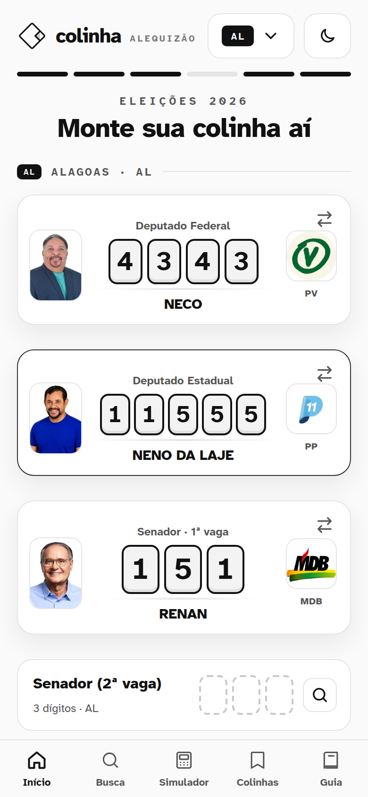
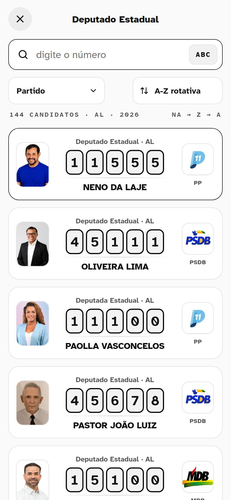
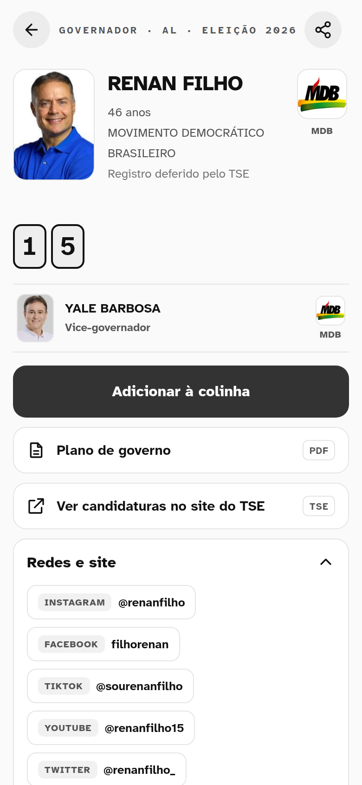
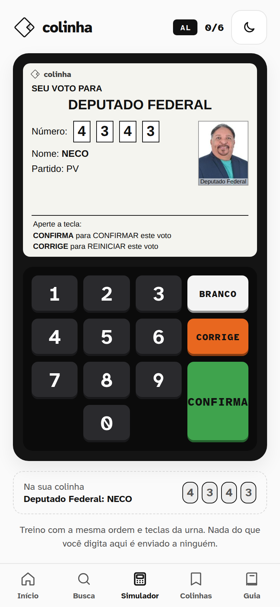
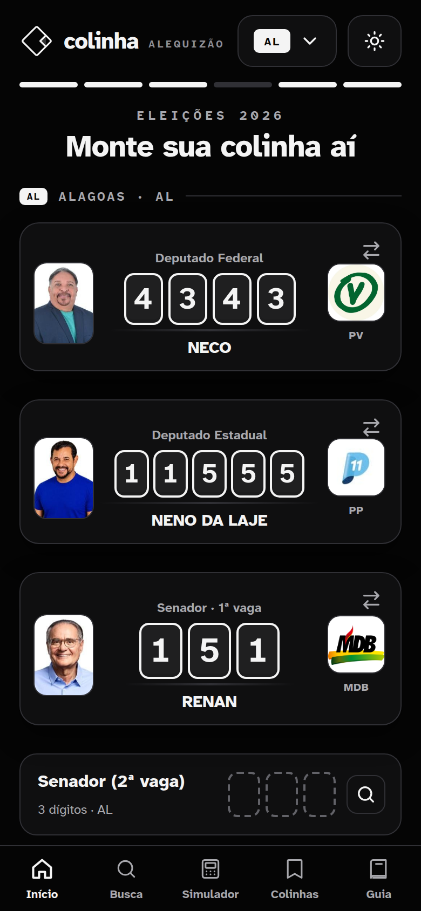
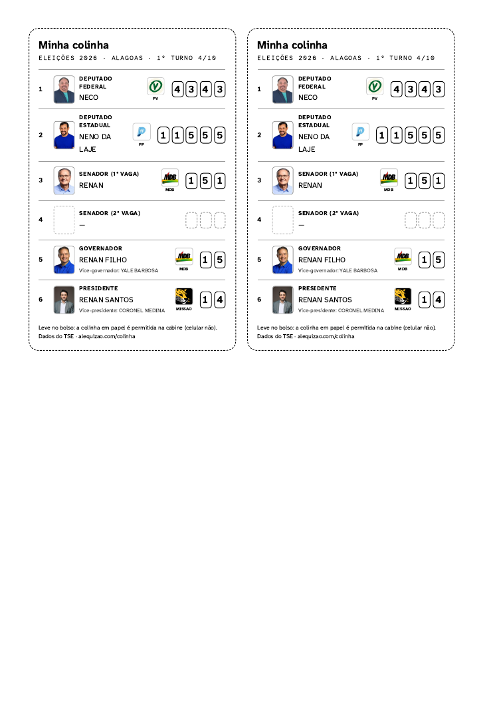
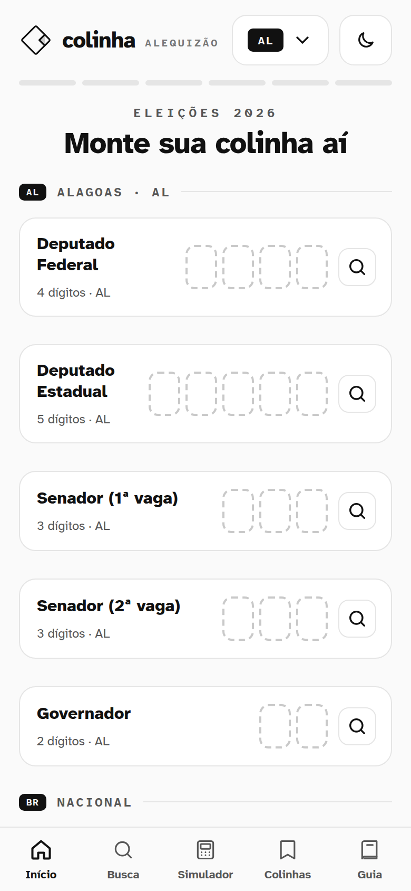
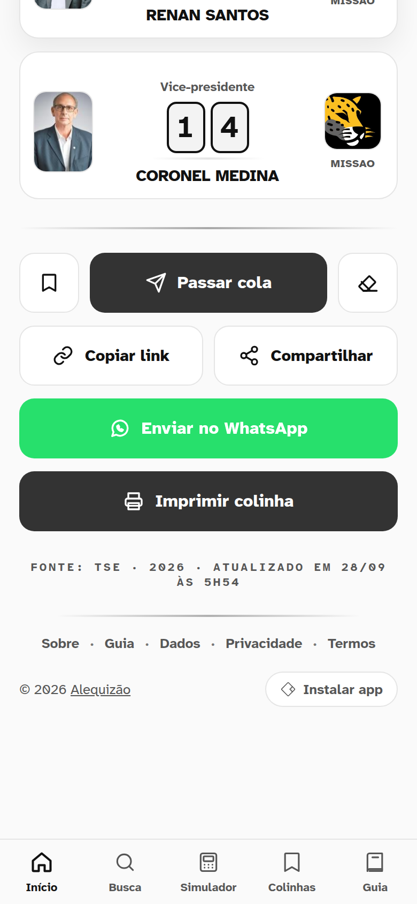
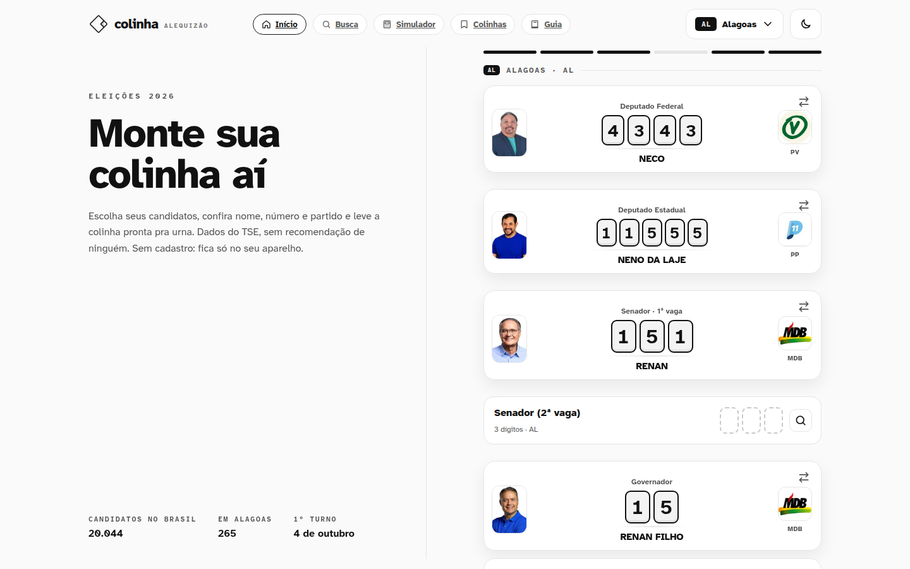

# 🗳️ Colinha · Alequizão — colinha eleitoral 2026

**Monte sua colinha para as Eleições 2026:** escolha seus candidatos, confira nome, número e partido e leve a colinha pronta para a urna. Os dados vêm do TSE, sem recomendação de ninguém. Não tem cadastro: a colinha fica só no seu aparelho.

🔗 **No ar:** [alequizao.com/colinha](https://alequizao.com/colinha/)


## 📸 Telas

| Colinha montada | Lista de candidatos | Perfil do candidato |
|:---:|:---:|:---:|
|  |  |  |

| Simulador de urna | Tema escuro | Impressão (2 vias no A4) |
|:---:|:---:|:---:|
|  |  |  |

<details>
<summary>Mais telas</summary>

| Início | Passar cola | Computador |
|:---:|:---:|:---:|
|  |  |  |

</details>

## ✨ O que faz

- **Os 6 votos na ordem da urna:** deputado federal (4 dígitos), deputado estadual ou distrital (5), senador 1ª e 2ª vaga (3), governador (2) e presidente (2), para os 27 estados.
- **Lista de candidatos** com busca por número ou por nome, filtro por partido e **ordem A-Z rotativa**: a letra inicial muda todo dia, para nenhum nome ficar sempre no topo.
- **Perfil do candidato:** vice e suplentes, situação no TSE, plano de governo em PDF, redes sociais, histórico eleitoral com votos e bens declarados.
- **Voto de legenda, nulo e branco.**
- **Passar cola:** link com os números (`/colinha/c/AL_1234-12345-...`), WhatsApp e compartilhamento nativo. Quem recebe pode usar a colinha como ponto de partida.
- **Impressão em 2 vias** com foto do candidato e logo do partido.
- **Várias colinhas salvas** (a sua, a da família...), guardadas no aparelho.
- **Simulador de urna** com as mesmas teclas (BRANCO, CORRIGE, CONFIRMA), som e a sua colinha ao lado.
- **Busca geral**, guia do eleitor, tema claro e escuro, versão para computador.
- **PWA:** instala como app e abre sem internet.
- **Privacidade:** nada do eleitor vai para o servidor. A API só entrega a lista pública de candidatos.

## 🧱 Como funciona

| Arquivo | Papel |
|---|---|
| `index.html` | página única, SEO, Open Graph e JSON-LD |
| `app.js` | o app inteiro, em JavaScript puro, sem framework |
| `app.css` | visual claro e escuro, impressão e layout para computador |
| `api.php` | API só de leitura: candidatos, número, legendas, busca, perfil e estatísticas |
| `midia.php` | fotos e logos com cache local (baixa uma vez, depois o Apache serve direto) |
| `sync.php` | sincronização diária dos candidatos (roda pelo cron) |
| `sw.js` | service worker: offline e cache da última lista consultada |
| `schema.sql` | estrutura do banco |

## 🚀 Instalação

```bash
mysql -u root -p -e "CREATE DATABASE colinha CHARACTER SET utf8mb4"
mysql -u root -p colinha < schema.sql
cp config.example.php config.php   # preencha usuário e senha do banco
php sync.php                       # primeira carga (~5 min, ~20 mil candidatos)
```

Cron diário:

```
20 6 * * * php /caminho/colinha/sync.php >> /var/log/colinha-sync.log 2>&1
```

Precisa de Apache com `mod_rewrite` e `mod_headers` (as rotas estão no `.htaccess`) e PHP com cURL e PDO MySQL.

## 📊 Fonte dos dados

Dados públicos do **Tribunal Superior Eleitoral (TSE)** para 2026. O portal do TSE bloqueia requisições do servidor, então a carga usa a API pública do [colinha.ai](https://colinha.ai/), que republica os mesmos dados. O projeto foi inspirado no colinha.ai.

## 👨‍💻 Desenvolvedor

Desenvolvido por **Alequizao**.

- **E-mail:** alequizao.dev@gmail.com
- **GitHub:** [@alequizao](https://github.com/alequizao)
- **Site:** [alequizao.com](https://alequizao.com/)

Quer um sistema como este? Entre em contato.

---

Palavras-chave: colinha eleitoral 2026, cola eleitoral, eleições 2026, número do candidato, simulador de urna, deputado federal, deputado estadual, senador, governador, presidente, TSE.
